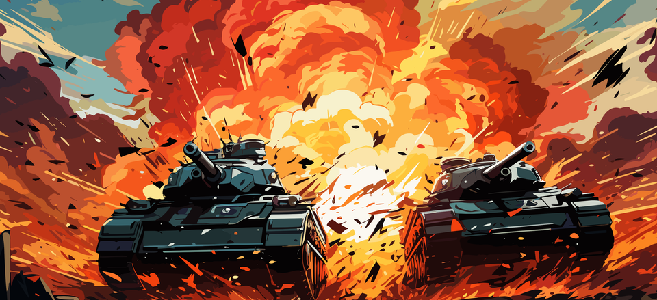

# UnityMasterClassTankAttack

### 인프런 동영상 강좌 - 네트워크 탱크 대전 게임

- [인프런 강좌 바로가기](https://inf.run/DbAJS)

Photon PUN2 엔진은 출시된 지 오래된 네트워크 게임 엔진이지만, 초보 개발자나 가벼운 네트워크 게임을 개발할 때 여전히 많이 사용되고 있습니다. 네트워크 게임 개발을 처음 배우는 경우, 난이도가 높지 않은 엔진을 선택하는 것도 좋은 접근 방법이 될 수 있습니다. 본 강의에서는 다음과 같은 내용을 학습합니다.

### 네트워크 게임 영역
- 네트워크 게임 개발의 필수 이론과 네트워크 용어 정리
- 포톤 PUN2 기초 사용법 - 포톤 클라우드 접속, Lobby 접속, 오브젝트 동기화, 룸 목록 관리
- 심화 내용 I - RPC, Player CustomProperties 활용법
- 심화 내용 II - 공격자 기반 피격 판정
- Play Mode 시뮬레이터 활용

### 인게임 영역
- Wheel Collider 활용 물리 적용
- 터렛의 자동 조준 및 재장전 로직
- Audio Mixer 활용한 사운드 최적화
- 옵저버 패턴, 이벤트 버스 패턴, 싱글턴 패턴, 의존성 주입 패턴 사용